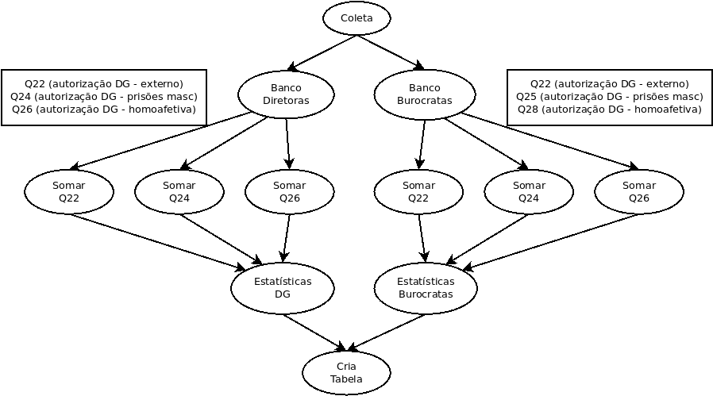

# ufpr-topicos-bd
Repositório para códigos e textos do componente curricular Tópicos em Banco de Dados

## diretório `trabalho1`

O trabalho 1 foi escolher um tema, montar uma equipe com 4 integrantes e estudar o estado da arte.
Após, fazer uma apresentação de seminário em aula de aproximadamente 50 minutos.

O tema escolhido foi **Workflow**.

A equipe montada é:
- Gabriel Silva Hermida
- Jefferson Luis Stefani Alves Pereira
- Josiney de Souza
- Lucas Sidnei dos Santos

Os artigos lidos do estado da arte:

| #  | Artigo                                                                               | Autor                   | Data |
| -  | ------                                                                               | -----                   | ---- |
| 1a | Characterizing of Scientific Workflows                                               | Bharathi et a.          | 2008 |
| 1b | Characterizing and Profiling Scientific Workflows                                    | Juve et al.             | 2013 |
| 2  | Scientific Workflows and Provenance: Introduction and Research Opportunities         | Cuevas-Vicenttín et al. | 2012 |
| 3  | Capturing and Querying Workflow Runtime Provenance with PROV: a Practical Approach   | Silva et al.            | 2013 |
| 4  | Dynamic steering of HPC scientific workflows: A survey                               | Mattoso et al.          | 2015 |
| 5  | Identifying impact of software dependencies on replicability of biomedical workflows | Miksa, Rauber, Mina     | 2016 |

Dentro do diretório há:
- [trabalho1/metodo-bissecao.c](trabalho1/metodo-bissecao.c): código-fonte em linguagem C usado na apresentação que exemplifica *workflow*;
- [trabalho1/topicos_bd_ufpr_trab1.pdf](trabalho1/topicos_bd_ufpr_trab1.pdf): apresentação em PDF do seminário apresentado em aula.

OBS.: Outro link interessante são os códigos-fonte da apresentação disponíveis [aqui](https://sharelatex.c3sl.ufpr.br/read/bxhfyvqspbkn)

## diretório `trabalho2`

O trabalho 2 foi se aprofundar no tema do trabalho 1 com a mesma equipe e com o mesmo tempo de 50 minutos.

Nesse segundo trabalho, fizemos:
- a recapitulação do trabalho 1;
- comentários sobre o trabalho intitulado "A vendor-agnostic, PACS integrated, and DICOM-compatible software-server pipeline for testing segmentation algorithms within the clinical radiology workflow", de Zhang et al., pre-print, 2023;
- discussões sobre a [Base de Dados Científicos](https://bdc.c3sl.ufpr.br/) da UFPR;
- uma análise sobre o trabalho intitulado "Entre o Amor Venéris e o Útero: Desdobramentos e Controles de Desgovernadas na Condução da Visita Íntima na Penitenciária Feminina do Paraná", Gitirana, 2020, tese de doutorado;
- o desenvolvimento de um *workflow* de exemplo sobre o trabalho "Entre o Amor Venéris e o Útero" conforme a imagem a seguir:

- uma fala sobre a preparação de dados;
- considerações sobre todo o trabalho desenvolvido.

De maneira geral, dentro do diretório há:

- o script de workflow e seus subscripts (p2-\*, p3-\*, p4-\*, p5-\*)
- o arquivo de configurações globais `confs.txt`
- a base da tabela em TEX e o código que a gera no site [Tables Generator](https://www.tablesgenerator.com/)
- o grafo que representa o workflow (editável e imagem)
- um arquivo PDF da apresentação feita no segundo seminário

OBS.: Outro link interessante são os códigos-fonte da apresentação disponíveis [aqui](https://sharelatex.c3sl.ufpr.br/read/xwfhnnwpgnyj)
